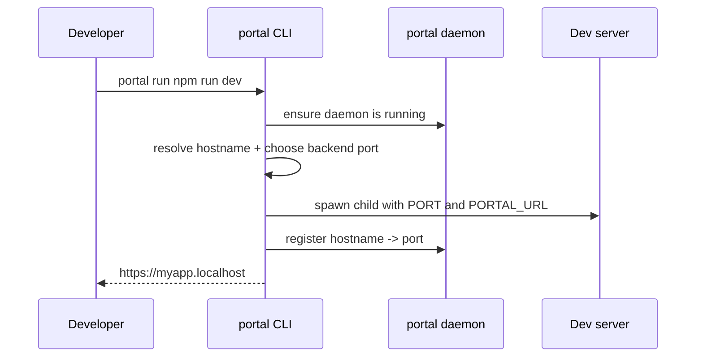
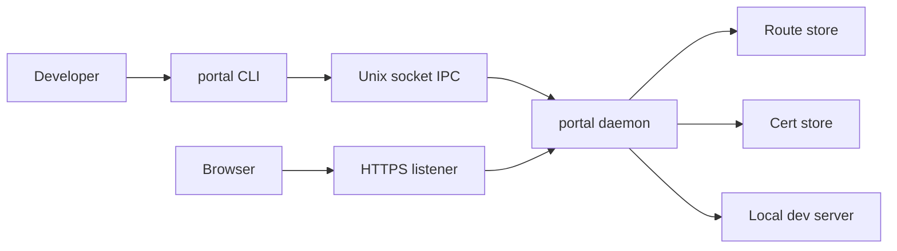
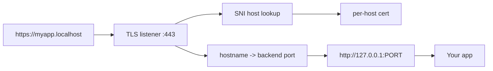
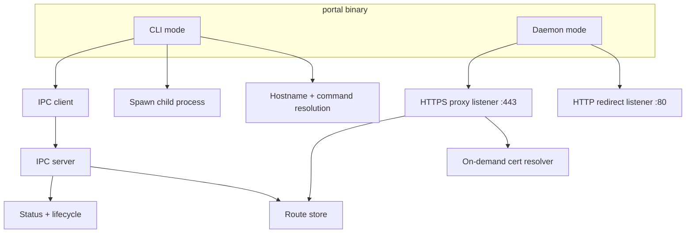
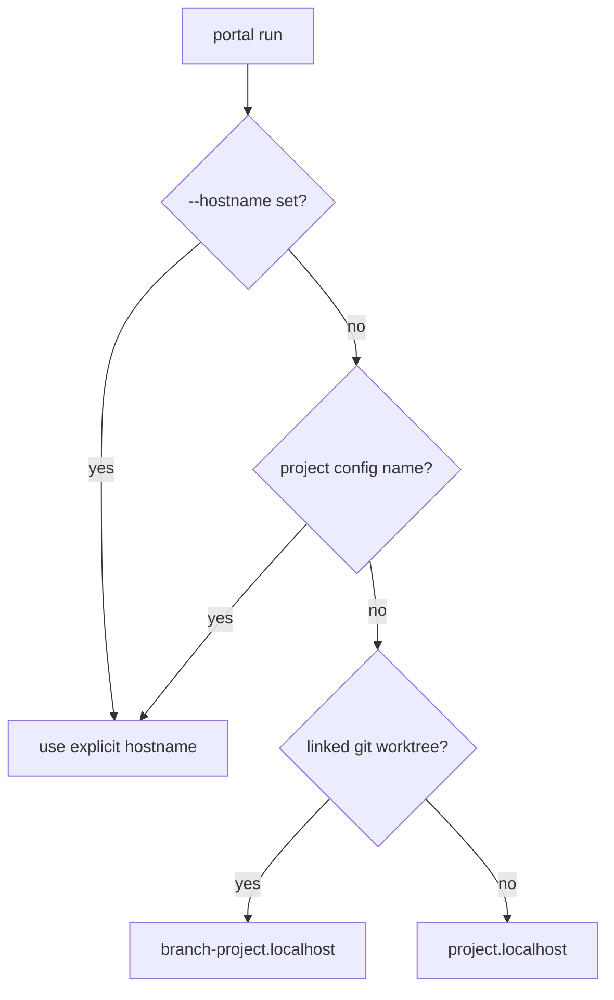
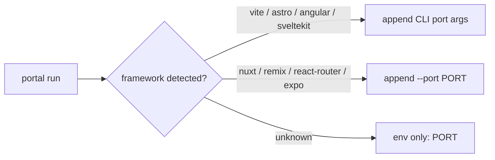
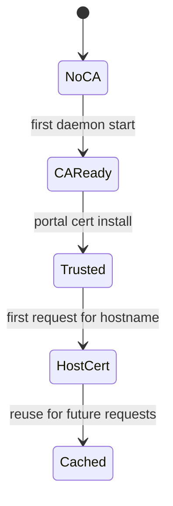
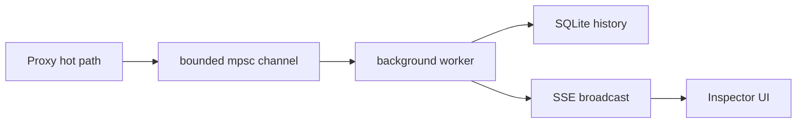

# portal

> Replace `localhost:3000` with `https://myapp.localhost`.

Portal gives every local app a real HTTPS URL on your machine.

- Run your normal dev server
- Get a named `.localhost` domain
- Terminate TLS locally
- Stop memorizing ports

```bash
portal run npm run dev

# before
http://localhost:3000

# after
https://myapp.localhost
```

## Why Portal

Most local dev still looks like this:

- `localhost:3000`
- `localhost:5173`
- `localhost:8080`
- a browser warning if you want HTTPS

Portal turns that into a cleaner surface:

- `https://web.localhost`
- `https://admin.localhost`
- `https://api.localhost`

It sits between your browser and your app, manages the local route, and issues the certificate needed to make `.localhost` feel like a real environment.

## What It Does

- Assigns a stable `.localhost` hostname to a dev server
- Serves that app through local HTTPS
- Starts and tracks app processes from the CLI
- Persists active routes in a daemon-owned route store
- Reuses clean hostnames from your project name or git worktree
- Injects ports for common JS frameworks automatically
- Works with arbitrary commands even when no framework is detected

Examples:

```bash
portal start
portal run dev
portal run npm run dev
portal run python manage.py runserver
portal run cargo run
portal run --hostname api npm start
portal run --port 4123 npm run dev
```

## Quickstart

Install:

```bash
curl -fsSL https://raw.githubusercontent.com/been-there-done-that/portal/main/install.sh | bash
```

Or build from source:

```bash
cargo install --git https://github.com/been-there-done-that/portal
```

Trust the local CA once:

```bash
sudo portal cert install
```

Then run an app:

```bash
portal start
# or
portal run npm run dev
```

If Portal is using privileged ports, it will start the local daemon with `sudo` when needed and then route traffic through `:80` and `:443`.

## First Run Flow



## How It Works

Portal is a single Rust binary with two roles:

- CLI mode: launch apps, resolve hostnames, talk to the daemon
- daemon mode: own the proxy, TLS, route registry, and IPC socket

At runtime, browser traffic and CLI control traffic are separate.



### Request Path



### Binary Architecture



## Product Model

Portal is not replacing your framework dev server. It is orchestrating around it.

1. You run your normal command.
2. Portal picks or receives a backend port.
3. Your app still listens locally on `127.0.0.1:PORT`.
4. Portal exposes it as `https://name.localhost`.
5. The daemon keeps that route alive until the process exits or you stop it.

That makes Portal useful even when framework detection is minimal, because the core value is routing and HTTPS, not framework ownership.

## Hostname Resolution

Portal resolves hostnames in this order:

1. `--hostname`
2. `portal.toml` project name override
3. package or manifest name when available
4. directory name
5. git worktree branch prefix when applicable



## Port Injection

Portal always sets `PORT=<assigned port>` and `PORTAL_URL=https://<hostname>`.

For common JS frameworks it also injects CLI flags automatically.



This lets a plain command keep working while still making common frontend workflows smoother.

## Install Modes

### Recommended: clean local HTTPS

Run with privileged ports:

```bash
portal start
```

Portal will start the daemon on `:80` and `:443` when needed.

### Unprivileged mode

If you do not want privileged ports, configure alternate ports in `~/.portal/config.toml`:

```toml
[proxy]
http_port = 8080
https_port = 4443
```

That gives you URLs like:

```text
https://myapp.localhost:4443
```

## Commands

| Command | Purpose |
| --- | --- |
| `portal start` | Auto-detect and run the best local start script |
| `portal run <cmd...>` | Run an arbitrary dev command behind a `.localhost` URL |
| `portal ls` | List active routes |
| `portal status` | Show daemon and route status |
| `portal stop <hostname>` | Stop a running route and kill its process |
| `portal rm <hostname>` | Remove a route without killing the process |
| `portal daemon` | Start the background daemon |
| `portal shutdown` | Stop the daemon |
| `portal cert install` | Install the local CA into the trust store |
| `portal cert reset` | Regenerate and reinstall the CA |
| `portal config` | Print the effective configuration |

## Configuration

Global config lives at `~/.portal/config.toml`.

```toml
[proxy]
tld = "localhost"
http_port = 80
https_port = 443
https = true
port_range = [4000, 4999]

[daemon]
log_level = "info"
auto_start = true
```

Project config lives in `portal.toml`.

```toml
[project]
name = "my-api"
```

Supported environment overrides:

- `PORTAL_TLD`
- `PORTAL_HTTPS`
- `PORTAL_HTTP_PORT`
- `PORTAL_HTTPS_PORT`
- `PORTAL_LOG`

## Certificate Lifecycle

Portal creates a local CA once, installs it into your trust store on request, and then issues per-host certificates as new `.localhost` hostnames are used.



## Current Architecture Notes

From the current repo state:

- the core CLI + daemon + proxy + cert flow is implemented
- route persistence is backed by a JSON route store
- request pages for 404, 502, and 508 are built in
- inspector modules exist in `src/inspector/` with SQLite, SSE, and a Svelte UI

The inspector work is best treated as an evolving subsystem rather than the primary README promise until the full runtime path is wired and stable.

## Inspector Pipeline

The request inspector architecture present in the repo is designed around a non-blocking capture path:



## Development

```bash
cargo build
cargo test
cargo install --path .
```

Debug daemon startup:

```bash
PORTAL_IS_DAEMON=1 PORTAL_LOG=debug portal daemon
```

## README Assets

The README should eventually ship with stronger visuals than plain markdown alone. The asset production brief lives at [docs/readme-assets-plan.md](docs/readme-assets-plan.md), and the research basis lives at [docs/readme-research-2026-04-08.md](docs/readme-research-2026-04-08.md).

## License

Apache-2.0
