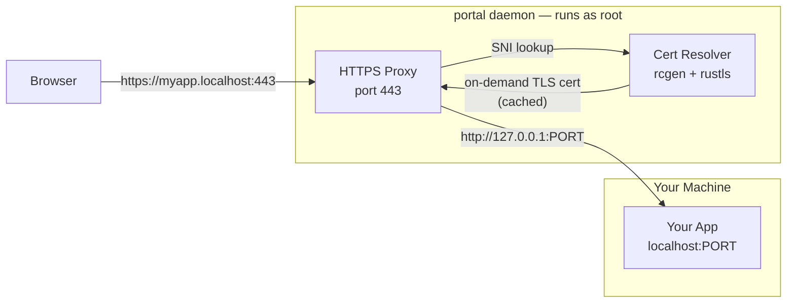
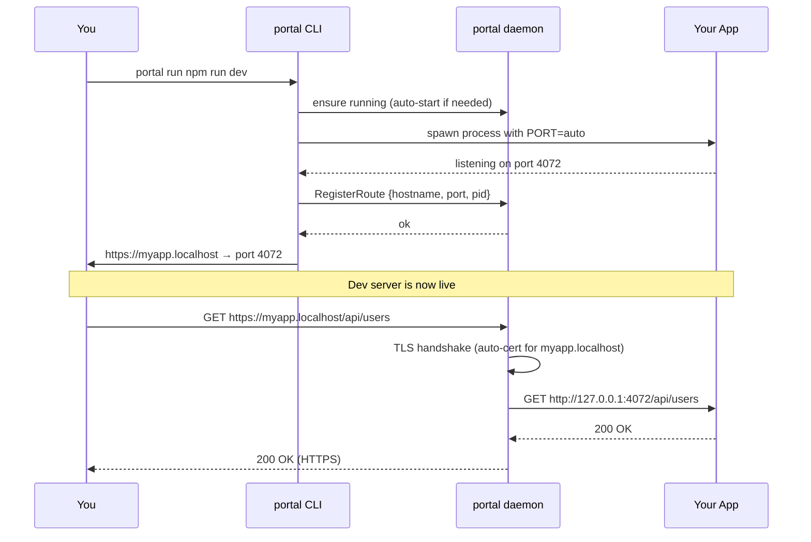
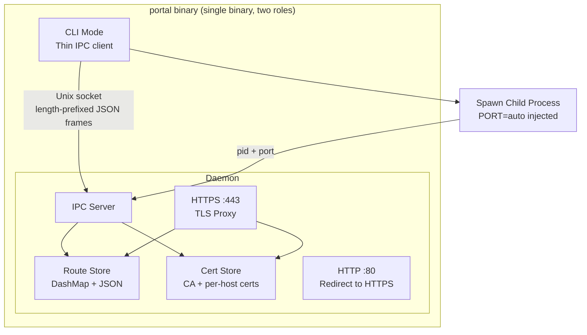
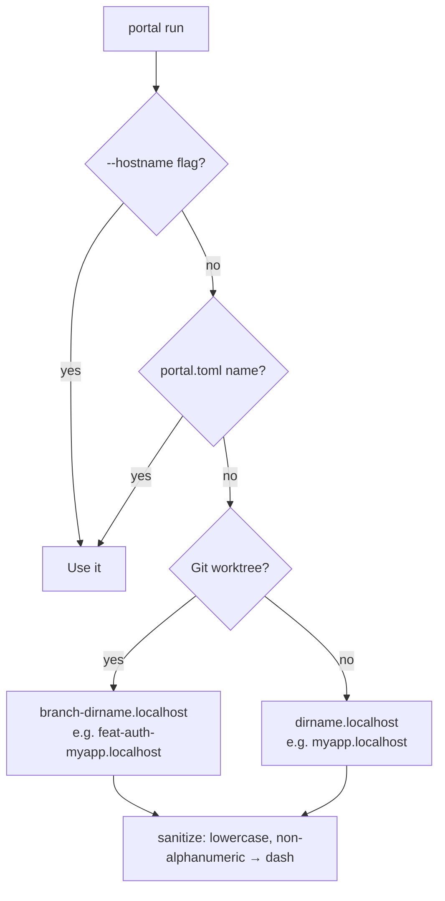
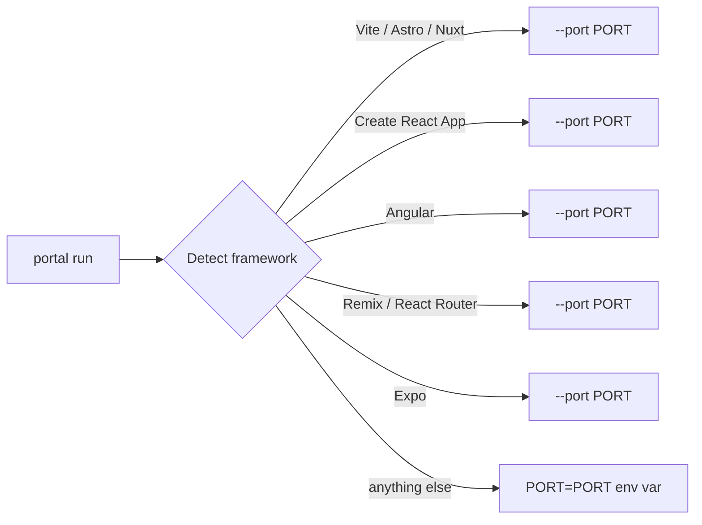
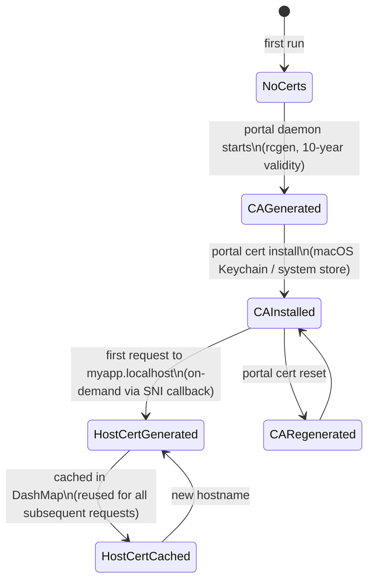
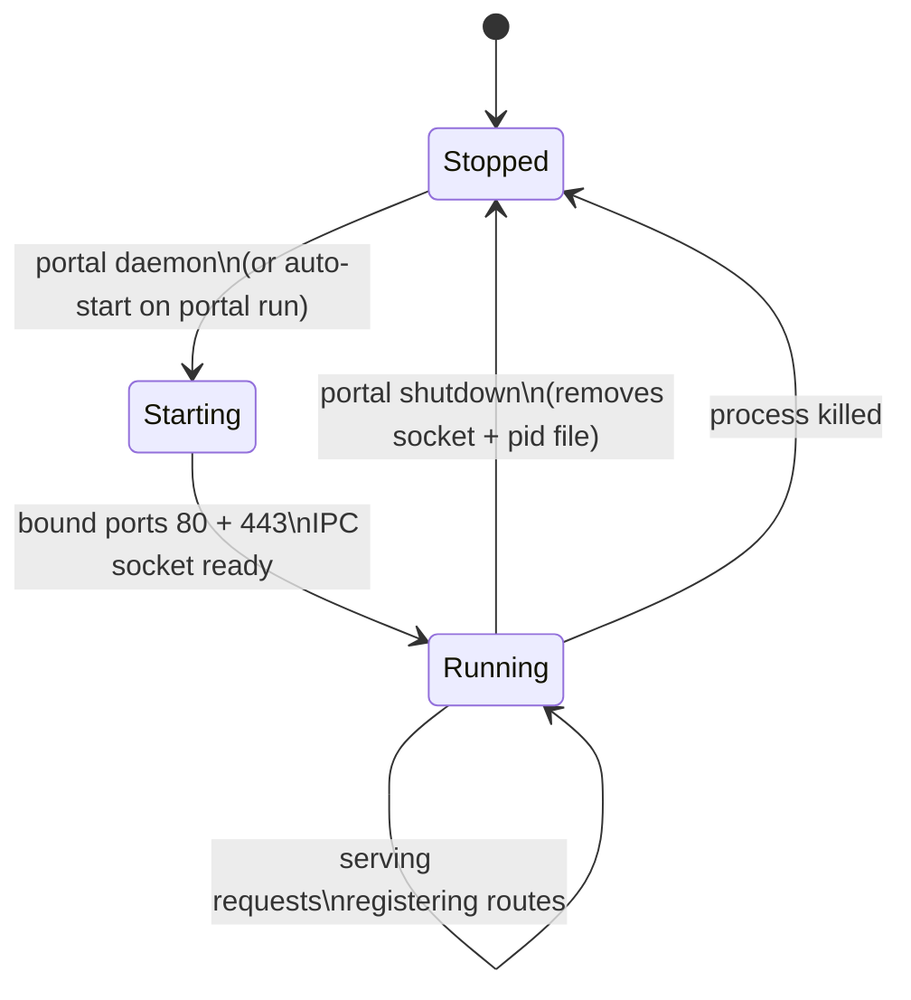

# portal

Replace `localhost:3000` with `https://myapp.localhost` — real URLs for local dev.

```
portal run npm run dev
# → https://myapp.localhost
```

---

## What it does

Portal assigns a clean `.localhost` HTTPS URL to any dev server. No more remembering port numbers, no more `http://`. Works with any framework — just wrap your start command.

```
portal run npm run dev          # → https://myapp.localhost
portal run yarn start           # → https://myapp.localhost
portal run python manage.py runserver  # → https://myapp.localhost
portal run --hostname api npm start    # → https://api.localhost
```

---

## How it works





---

## Architecture



### IPC Protocol

All CLI→daemon communication uses a Unix socket at `~/.portal/portal.sock` with length-prefixed JSON frames:

```
[4-byte big-endian u32 length][UTF-8 JSON payload]
```

Commands: `ls`, `status`, `run`, `stop`, `rm`, `shutdown`, `cert_install`, `cert_reset`, `register_route`

---

## Install

```bash
curl -fsSL https://raw.githubusercontent.com/been-there-done-that/portal/main/install.sh | bash
```

Or build from source:

```bash
cargo install --git https://github.com/been-there-done-that/portal
```

### First-time setup

Install the local CA into your system trust store (needed once):

```bash
sudo portal cert install
```

Then restart your browser. All `.localhost` URLs will show the padlock.

### Privileged ports (recommended)

Running on ports 80/443 gives you clean `https://myapp.localhost` URLs without a port number:

```bash
sudo portal daemon
```

For non-root use, portal defaults to `8080`/`4443`. Configure in `~/.portal/config.toml`:

```toml
[proxy]
http_port = 8080
https_port = 4443
```

---

## Usage

```
portal <command> [options]
```

| Command | Description |
|---------|-------------|
| `portal run <cmd>` | Start a dev server and assign it a `.localhost` URL |
| `portal run --force <cmd>` | Kill any existing instance first, then start |
| `portal run --hostname <name> <cmd>` | Use a specific hostname |
| `portal ls` | List all active routes |
| `portal stop <hostname>` | Stop a running server |
| `portal status` | Show daemon info |
| `portal daemon` | Start the background daemon |
| `portal shutdown` | Stop the daemon |
| `portal cert install` | Install the local CA |
| `portal cert reset` | Regenerate and reinstall the CA |

### Hostname detection

Portal picks the hostname automatically from the project directory:



### Framework port injection

Portal detects the framework and injects the port the right way — no config needed:



---

## Configuration

### `~/.portal/config.toml` — global

```toml
[proxy]
tld = "localhost"           # TLD for generated hostnames
http_port = 80              # HTTP redirect listener
https_port = 443            # HTTPS proxy listener
https = true                # Enable HTTPS
port_range = [4000, 4999]   # Range for auto-assigned backend ports

[daemon]
log_level = "info"
auto_start = true
```

### `portal.toml` — per-project

```toml
[project]
name = "my-api"             # Overrides auto-detected hostname
```

### Environment variables

| Variable | Description |
|----------|-------------|
| `PORTAL_TLD` | Override TLD |
| `PORTAL_HTTPS` | `1`/`true`/`yes`/`on` to enable HTTPS |
| `PORTAL_HTTP_PORT` | Override HTTP port |
| `PORTAL_HTTPS_PORT` | Override HTTPS port |
| `PORTAL_LOG` | Log level (`debug`, `info`, `warn`, `error`) |

---

## Certificate lifecycle



The CA key lives at `~/.portal/certs/ca-key.pem` (mode `0600`). Per-host certs are generated on first request and kept in memory — no disk writes per hostname.

---

## Daemon lifecycle



The daemon uses a **re-spawn approach** (not double-fork) to avoid fork-in-async-runtime issues. The CLI spawns itself with `PORTAL_IS_DAEMON=1` and exits — the child becomes the daemon.

---

## Development

```bash
# Build
cargo build --release

# Run tests
cargo test

# Install locally
cargo install --path .

# Run daemon in foreground (for debugging)
PORTAL_IS_DAEMON=1 PORTAL_LOG=debug portal daemon
```

---

## License

Apache-2.0
