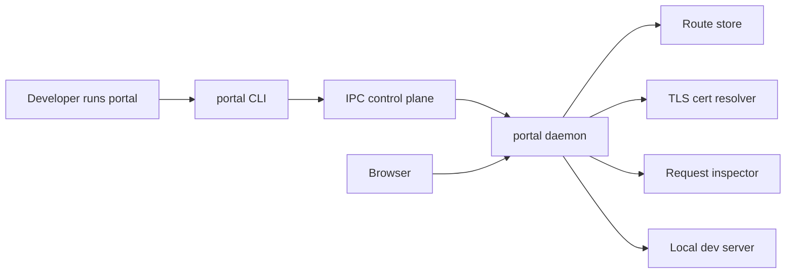
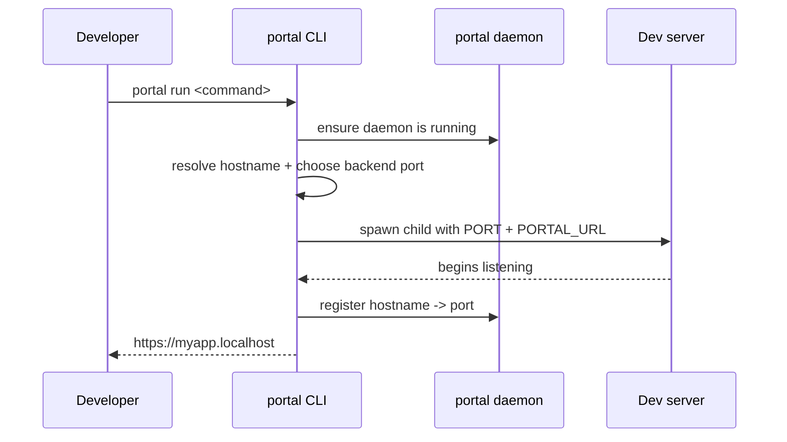
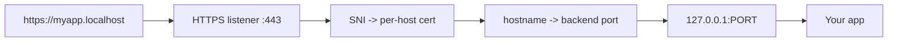
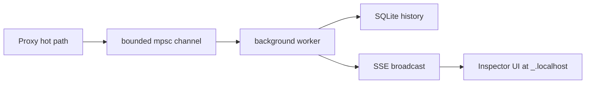
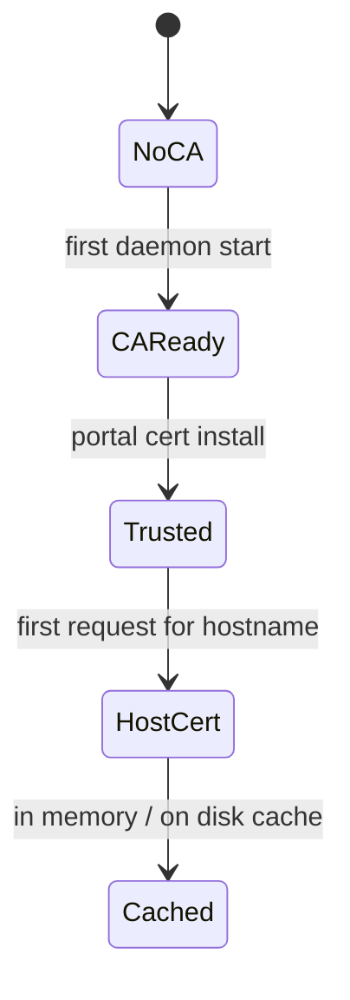

# Portal README Research Brief

Date: 2026-04-08

## Objective

Design a significantly stronger top-level README for `portal` that:

- makes the product instantly legible in the first screenful
- looks current next to high-traction developer-tool repos
- explains the local-dev URL + HTTPS value prop without making readers parse architecture first
- leaves room for the request inspector and multi-language direction
- gives contributors and first-time users one clean path from "what is this?" to "I want it running"

## What Portal Actually Is

Portal is not just "another local proxy".

The repo implements a local development routing system with these product-defining pieces:

- a CLI that starts or wraps dev servers
- a background daemon that owns ports 80/443 and route registration
- on-demand TLS for `*.localhost`
- automatic hostname resolution from project/worktree context
- framework/language-aware port injection
- route persistence and stale cleanup
- a request inspector subsystem with SQLite + SSE + a Svelte UI

That means the README should position Portal as:

**"named HTTPS app URLs for local development, backed by a local daemon and smart process orchestration."**

Not as:

- only a reverse proxy
- only a CLI wrapper
- only a cert helper

## Repo Findings

### Strong repo qualities

- The product demo is naturally strong: `portal run npm run dev -> https://myapp.localhost`
- The daemon/proxy split is real and worth diagramming.
- The internal docs show a polished product direction: startup UX, status UX, conflict resolution, request inspector.
- The request inspector gives the project a second visual anchor beyond terminal screenshots.
- Installation is simple enough to market aggressively.

### Current README problems

- It starts with the right idea, but the presentation is too text-heavy too early.
- The strongest emotional payoff is buried inside technical sections.
- The README reads like engineering notes more than a product page.
- There is no visual hierarchy beyond headings and Mermaid blocks.
- It lacks "trust builders" near the top:
  - screenshots
  - terminal demo
  - strong feature tiles
  - comparison framing
- The diagrams are informative, but they arrive before the reader is sold.
- The request inspector and multi-language direction are missing from the top-level story.

## Internal Product Story To Preserve

These themes show up repeatedly in the code and design specs and should shape the new README:

- Localhost should feel like a real URL surface, not raw ports.
- HTTPS should be automatic, local, and believable.
- The CLI should feel premium and "one command" simple.
- Root/daemon complexity should be hidden behind smooth UX.
- Portal should feel framework-agnostic and increasingly language-agnostic.
- The request inspector can evolve into a memorable differentiator.

## Current README Pattern Research

I checked GitHub Trending on 2026-04-08 and then sampled current, high-visibility developer-tool READMEs to understand the dominant presentation patterns.

### Repos reviewed

- `astral-sh/uv`
- `oven-sh/bun`
- `charmbracelet/crush`
- `charmbracelet/gum`
- `shadcn-ui/ui`
- `supabase/supabase`
- `localstack/localstack`
- `coollabsio/coolify`

## What Strong READMEs Are Doing Now

### 1. The hero is productized, not descriptive

High-performing READMEs now lead with:

- a short, opinionated one-line value proposition
- visual proof immediately below it
- docs/install links before long prose

Observed in:

- `uv`: short thesis, badges, benchmark image, then highlights
- `Bun`: single-sentence product definition, docs link, then code examples
- `Crush`: logo, short pitch, animated demo, then feature bullets
- `shadcn/ui`: short statement plus a hero image almost immediately

Implication for Portal:

- the first screen should show a terminal-first hero and one visual proof asset
- architecture should not be the first thing readers must parse

### 2. Strong READMEs make the "moment of conversion" obvious

The best READMEs let the user imagine success in under 10 seconds.

Common tactics:

- one install command
- one run command
- one obvious result

Portal already has this, but the current README dilutes it with too much explanation before reinforcing the payoff.

Recommended Portal pattern:

```bash
portal run npm run dev

# before
http://localhost:3000

# after
https://myapp.localhost
```

### 3. Screenshots beat diagrams near the top

Current developer-tool READMEs increasingly place:

- terminal screenshots
- product UI screenshots
- benchmark or workflow graphics

before deep technical diagrams.

Observed in:

- `uv` benchmark visual
- `Crush` demo image
- `Supabase` dashboard image
- `shadcn/ui` hero visual

Implication for Portal:

- the README needs at least one polished terminal image
- if the inspector is real enough, it should be the second key image

### 4. Feature sections are becoming more tile-like and less essay-like

The strongest READMEs now compress the sales layer into:

- short bullets
- grouped capability blocks
- skimmable labels

Good model for Portal:

- "Real URLs"
- "Automatic HTTPS"
- "Smart port orchestration"
- "Daemon-backed routing"
- "Request inspection"
- "Framework/language aware"

### 5. Install and docs placement are aggressively early

`Bun`, `uv`, `LocalStack`, and `Coolify` all reduce friction by surfacing installation near the top.

Portal should do the same:

- Hero
- Demo
- Why this exists
- Install
- Quickstart

Not:

- Hero
- long architecture explanation
- configuration
- install later

### 6. The best technical READMEs separate product story from systems story

The most effective repos do not mix:

- the "why should I care?" layer
- the "how it works under the hood" layer

Portal should explicitly split these.

Recommended split:

- top half: product page
- bottom half: architecture and internals

## Recommended README Visual Direction

### Design theme

Use a **terminal-native, high-contrast, polished-infrastructure** aesthetic.

It should feel closer to:

- `uv` speed/confidence
- `Crush` terminal polish
- `Supabase` visual productization

And less like:

- a generic OSS utility README
- a pure protocol spec

### Visual traits

- dark, crisp hero images even if the README itself stays GitHub-native
- bold monospace snippets
- restrained badge use
- 2-3 strong visuals max above the fold-equivalent sections
- diagrams that look like product architecture, not internal scratch notes

### Tone

Use confident, short product copy:

- "Real local URLs."
- "HTTPS by default."
- "One command."
- "Works with your existing dev server."

Avoid:

- apologetic phrasing
- over-explaining Linux/macOS details too early
- long paragraphs before proof

## Recommended README Structure

### 1. Hero

Contents:

- project name
- one-line pitch
- minimal badges
- docs / install / demo anchors
- hero visual: terminal screenshot or animated GIF

Draft positioning:

**Portal gives every local app a real HTTPS URL.**

Subline:

Run your normal dev server. Open `https://myapp.localhost`. Stop memorizing ports.

### 2. 10-second demo

Show one command, one result, one short explanation.

### 3. Why Portal

Three to six short capability bullets:

- named `.localhost` URLs
- automatic TLS certs
- route registry + daemon
- smart dev-server startup
- optional request inspector
- works with multiple stacks

### 4. Visual proof

Put the best screenshot here if not already in the hero:

- either the terminal run flow
- or the request inspector dashboard

### 5. Quickstart

- install
- trust certificate
- run daemon if needed
- run app

### 6. How it works

Add a short explanatory paragraph, then architecture diagrams.

### 7. Architecture

Include:

- system overview diagram
- run/start lifecycle diagram
- request path diagram
- inspector diagram if that feature is stable enough to mention

### 8. Use cases / framework support

Short examples:

- Node / Vite
- Python / Django or Uvicorn
- Rust / `cargo run`
- custom command

### 9. Config

Keep concise with a pointer to docs if docs expand later.

### 10. Commands

Compact table.

### 11. Internals / contribution

Only after the product story is complete.

## Recommended Image Set

The new README should not rely on text only. It needs assets.

### Required image 1: Hero terminal screenshot

Purpose:

- immediate product proof
- shows polish

What it should show:

- `portal start` or `portal run npm run dev`
- polished setup output
- final URL line
- subtle but visible "real URL" payoff

Format:

- PNG for static hero
- optional short GIF/WebP if animation is worth the file size

### Required image 2: Request inspector screenshot

Purpose:

- gives the repo a second visual identity beyond the terminal
- shows this is becoming a real local-dev platform, not just a tiny CLI wrapper

What it should show:

- left route list
- request feed
- request detail pane
- at least one realistic API request selected

Note:

- if the inspector is not fully wired yet, do not fake it in the README as shipped
- use this only once the feature is actually runnable or clearly marked as preview

### Required image 3: Architecture overview SVG

Purpose:

- cleaner than Mermaid screenshots
- reusable in docs/site later

Should show:

- browser
- `portal` daemon
- cert resolver
- route store
- app process
- request inspector

### Optional image 4: Before/after comparison graphic

Purpose:

- fast comprehension

Split panel:

- `localhost:3000`, `localhost:5173`, `localhost:8080`
- versus `app.localhost`, `admin.localhost`, `api.localhost`

### Optional image 5: CLI lifecycle GIF

Purpose:

- stronger social-sharing asset
- useful for README and posts

Sequence:

- install
- cert trust
- run command
- open browser

## Recommended Diagram Set

The README should use fewer but better diagrams.

### Diagram A: Product/system overview

Use in README.



What this communicates:

- single binary
- split responsibilities
- browser traffic and CLI control are separate flows

### Diagram B: `portal run` lifecycle

Use in README.



What this communicates:

- Portal is orchestrating, not replacing, the user's app

### Diagram C: Request path

Use in README.



What this communicates:

- why HTTPS works
- where hostname routing happens

### Diagram D: Inspector pipeline

Use only if inspector is present in the README's public story.



### Diagram E: Certificate lifecycle

Better for docs than for the top README, but worth keeping.



## Aesthetic Recommendations Specific To Portal

### What should feel premium

- terminal output screenshots
- typography inside code blocks
- spacing between sections
- diagrams with clean nouns, not implementation noise

### What should be visually de-emphasized

- raw protocol details
- giant command tables near the top
- configuration internals
- platform caveats before the quickstart

### Color direction for generated assets

For custom screenshots/diagrams:

- charcoal / graphite background
- cool white and muted gray text
- one accent color only
- recommended accent: electric cyan or vivid blue
- avoid default purple gradients

This matches the product better than soft SaaS gradients.

## Proposed README Copy Angles

Pick one of these as the primary framing line.

### Option 1

**Real HTTPS URLs for local development.**

Best for clarity.

### Option 2

**Replace `localhost:3000` with `https://myapp.localhost`.**

Best for immediate before/after understanding.

### Option 3

**A local dev router for humans.**

Best if you want stronger brand voice, but weaker for first-contact clarity.

Recommended choice: **Option 2** as headline, **Option 1** as subline.

## Risks To Avoid In The New README

- Overselling features that are not fully wired yet, especially inspector functionality.
- Leading with diagrams before proving the product payoff.
- Using too many badges.
- Turning the README into a full manual.
- Shipping screenshots that look less polished than the terminal output actually is.
- Mixing current stable behavior with roadmap behavior without labeling it.

## Concrete Recommendation

The new README should be built as:

1. product hero
2. one-command demo
3. short feature proof
4. quickstart
5. polished architecture section
6. command/config reference

The visual package should include:

- one polished terminal hero
- one inspector screenshot when stable
- one custom SVG architecture overview
- Mermaid source kept in-repo for maintenance, but exported images used in the README when possible

## Source Notes

External references reviewed on 2026-04-08:

- GitHub Trending: https://github.com/trending
- uv: https://github.com/astral-sh/uv
- Bun: https://github.com/oven-sh/bun
- Crush: https://github.com/charmbracelet/crush
- gum: https://github.com/charmbracelet/gum
- shadcn/ui: https://github.com/shadcn-ui/ui
- Supabase: https://github.com/supabase/supabase
- LocalStack: https://github.com/localstack/localstack
- Coolify: https://github.com/coollabsio/coolify

Internal repo references:

- `README.md`
- `src/cli/mod.rs`
- `src/daemon/mod.rs`
- `src/daemon/ipc.rs`
- `src/proxy.rs`
- `src/routes.rs`
- `src/certs.rs`
- `src/inspector/`
- `docs/superpowers/specs/*.md`
